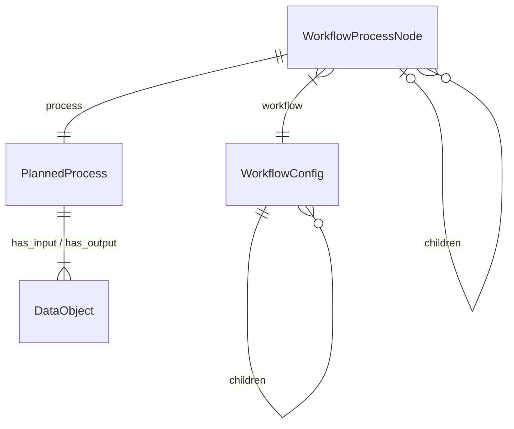
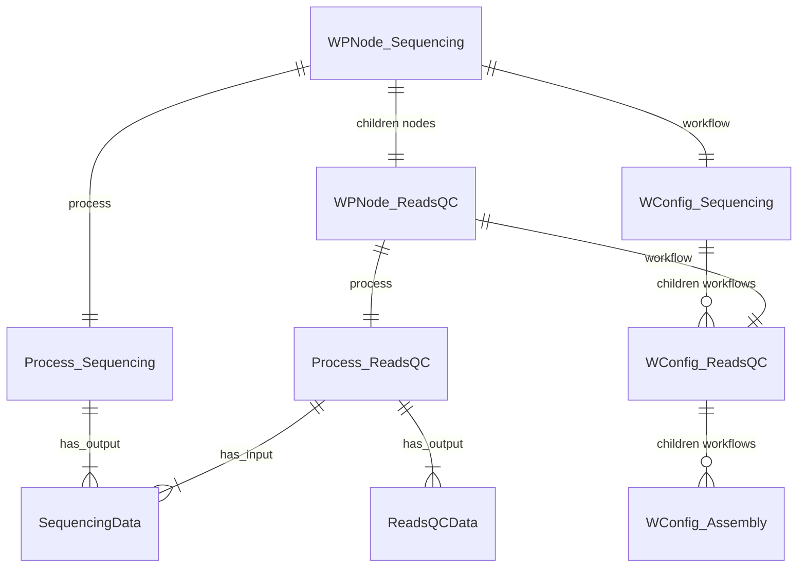
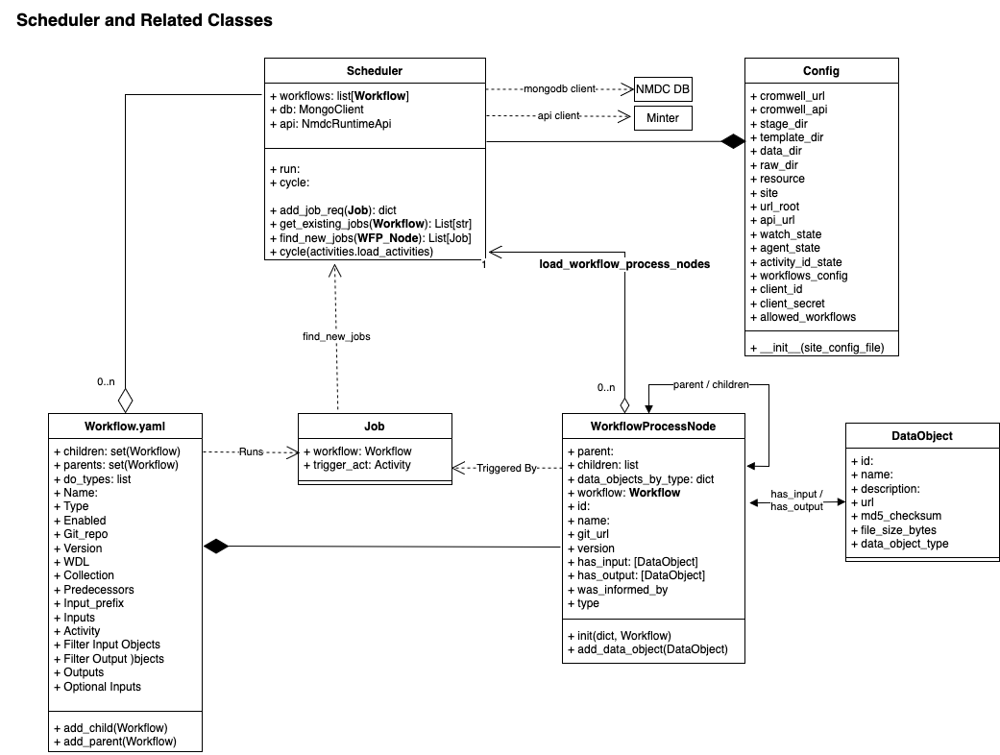
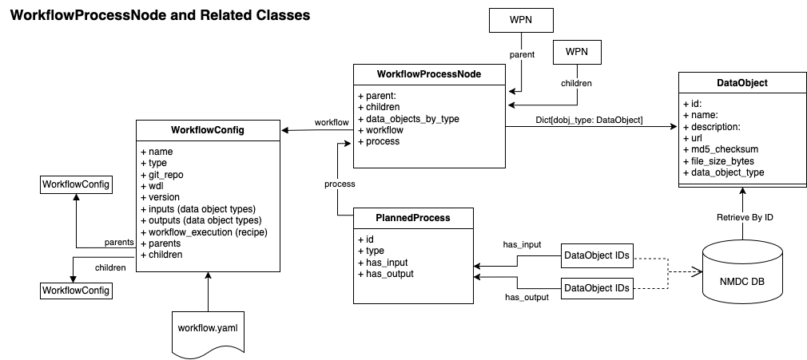
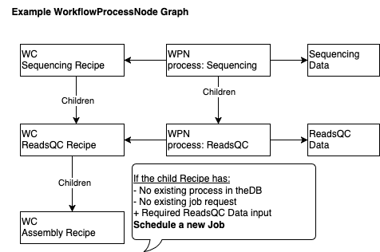
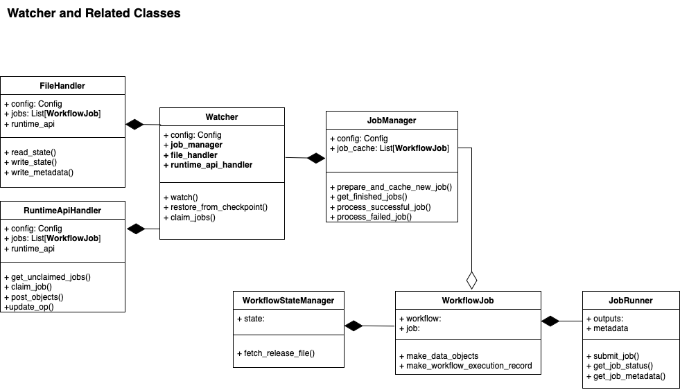
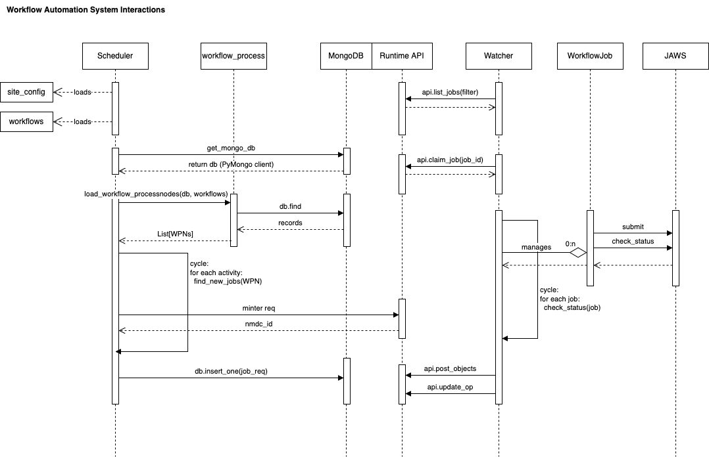

# Developer Documentation for NMDC Workflow Automation

This document provides an overview of the NMDC Workflow Automation system, including the Scheduler and Workflow Process Node Loader components. It is intended for developers working on the NMDC project, particularly those involved in workflow automation and job scheduling.

## Table of Contents

- [Developer Documentation for NMDC Workflow Automation](#developer-documentation-for-nmdc-workflow-automation)
  - [Table of Contents](#table-of-contents)
    - [System Architecture \& Components](#system-architecture--components)
      - [Components](#components)
        - [Scheduler](#scheduler)
        - [Workflow Process Node Loader](#workflow-process-node-loader)
        - [Watcher](#watcher)
        - [WorkflowJob \& JobRunner](#workflowjob--jobrunner)
      - [Interactions \& Data Flow](#interactions--data-flow)
  - [Developer Quickstart](#developer-quickstart)
  - [Configuration \& Environment](#configuration--environment)
    - [TOML Site Config](#toml-site-config)
    - [YAML Workflow Definitions](#yaml-workflow-definitions)
    - [Environment Variables](#environment-variables)
  - [Core Modules \& References](#core-modules--references)
  - [Development Workflow \& Debugging](#development-workflow--debugging)
  - [Testing](#testing)
  - [Algorithm Internals](#algorithm-internals)
  - [External Service Integrations](#external-service-integrations)
  - [Safety Notes for Production](#safety-notes-for-production)
  - [Poetry Environment](#poetry-environment)
  - [NMDC Workflow Scheduler](#nmdc-workflow-scheduler)
    - [Key Classes \& Functions](#key-classes--functions)
      - [Scheduler](#scheduler-1)
      - [SchedulerJob](#schedulerjob)
    - [Environment Variables](#environment-variables-1)
    - [Example](#example)
      - [Running Scheduler](#running-scheduler)
    - [Dependencies](#dependencies)
  - [NMDC Workflow Process Node Loader](#nmdc-workflow-process-node-loader)
    - [Algorithm Overview](#algorithm-overview)
    - [Diagrams](#diagrams)

---


### System Architecture & Components

**Overview**
The NMDC Workflow Automation system automates metagenome workflow executions by discovering upstream activities and creating downstream jobs when input data and version compatibility allow. It builds a graph of workflow activities from provenance data, constructs job definitions, and submits them to a configured runner (e.g., JAWS / Cromwell), while tracking status and processing outputs.

#### Components

##### Scheduler
- **Purpose:** Scan MongoDB for upstream workflow activities (DataGeneration / WorkflowExecution) and create downstream job records when requirements are met.
- **Key behavior:** Loads workflow definitions from `workflows.yaml`, builds `WorkflowProcessNode` graphs (via `load_workflow_process_nodes()`), and schedules jobs when child inputs exist and no child node/job already exists. Key methods include `cycle()`, `find_new_jobs()`, and `create_job_rec()`.
- **Job creation:** Constructs job records with WDL path, repository/version, input object URLs, execution metadata (`was_informed_by`, iteration, input prefix), and optional pre-minted output IDs (via `NmdcRuntimeApi`). Jobs are written to the MongoDB `jobs` collection (unless `DRYRUN=1`).
- **Flags & env vars:** `DRYRUN`, `FORCE`, `ALLOWLISTFILE`, `SKIPLISTFILE`, `MOCK_MINT`.

A `Workflow Process Node` is a representation of:
- `workflow` - the workflow configuration, from `workflows.yaml` (may include `workflow.children`)
- `process` - the planned process from MongoDB (DataGeneration or WorkflowExecution)
- `parent` and `children` pointers linking upstream and downstream nodes

<details><summary>Workflow Process Node Mermaid Diagram:</summary>


</details>

When a scheduler node meets these criteria it will schedule a child workflow:
1. The node lists a child workflow in `node.workflow.children`.
2. The node currently has no corresponding child node in `node.children`.
3. The required inputs for the child workflow are available in the node's process outputs.

<details><summary>Scheduler Process Mermaid Diagram:</summary>


</details>

##### Workflow Process Node Loader
- **Purpose:** Build a DAG of `WorkflowProcessNode` objects from DB records, associating nodes with the DataObjects they consume and produce.
- **Algorithm overview:** 
   1) Load required DataObjects and build an id→object map; 
   2) Identify relevant activities by analyte category, input/output filters and version compatibility;  
   3) Map outputs to producing nodes;  
   4) Resolve parent/child relationships by shared inputs. Version compatibility relies on major/minor matching (or can be forced).

##### Watcher
- **Purpose:** Monitor the `jobs` collection, claim unclaimed jobs, and manage execution lifecycle.
- **Behavior:** For each claimed job the Watcher creates a `WorkflowJob` (containing a `WorkflowStateManager` and a `JobRunner`), submits the job to the runner, polls for status, and processes success/failure. The Watcher records its activity in a state file.

##### WorkflowJob & JobRunner
- **WorkflowJob:** Combines a state manager and job runner to prepare inputs, submit workflows, and track execution.
- **JobRunner responsibilities:** Prepare inputs, submit to JAWS / Cromwell (or other runner), handle post-run data and metadata processing, and update job status via `NmdcRuntimeApi`.

#### Interactions & Data Flow
- **External systems:** MongoDB (metadata & jobs), NMDC Runtime API (ID minting & updates), JAWS / Cromwell (workflow execution), YAML workflow definitions, TOML site configs.
- **Data flow (summary):**
  1. Scheduler queries MongoDB and builds a `WorkflowProcessNode` graph.
  2. Scheduler creates job records for runnable workflows.
  3. Watcher claims and runs jobs via JAWS or another runner.
  4. Watcher / JobRunner updates job status and outputs to the API / DB.

> See the **Configuration & Environment** and **Developer Quickstart** sections below for env vars and usage examples.

---

## Developer Quickstart

Clone, install dependencies, and test:

```bash
git clone https://github.com/microbiomedata/nmdc_automation.git
cd nmdc_automation
poetry install
poetry shell
# if poetry shell doesn't work, try: poetry env activate

# Start MongoDB (mac example)
brew services start mongodb-community

# Run tests
make test

# Dry-run scheduler with allowlist
DRYRUN=1 ALLOWLISTFILE=allow.lst python -m nmdc_automation.workflow_automation.sched path/to/site_configuration.toml path/to/workflows.yaml
```

## Configuration & Environment
### TOML Site Config

Defines site-specific settings such as API credentials, runner URLs, and filesystem paths.

Example:
```toml
[nmdc_api]
url = "https://api.microbiomedata.org"
username = "user"
password = "pass"

[runner]
type = "jaws"
url = "https://jaws.api"
```
### YAML Workflow Definitions
Describes workflows with inputs, outputs, children, versions, and WDL references.

Example:
```yaml
- name: ReadsQC
  type: reads_qc
  version: 1.2.0
  inputs:
    - SequencingData
  outputs:
    - ReadsQCData
  children:
    - Assembly
```

### Environment Variables

| Variable        | Effect                         |
| --------------- | ------------------------------ |
| `DRYRUN=1`      | Jobs not inserted into MongoDB |
| `FORCE=1`       | Ignore version compatibility   |
| `ALLOWLISTFILE` | Only schedule listed IDs       |
| `SKIPLISTFILE`  | Skip listed IDs                |
| `MOCK_MINT=1`   | Use fake IDs for testing       |

## Core Modules & References

`nmdc_automation.scheduler`
- Orchestrates discovery and job creation
- Key functions: cycle(), find_new_jobs(), create_job_rec()
- Key classes:
  - Scheduler: main scheduling loop
  - SchedulerJob: holds workflow config & trigger node

`nmdc_automation.workflow_automation.workflow_process`
- Builds DAG of workflow activities from DB
- Key function: load_workflow_process_nodes(db, workflows, allowlist)
- Key classes:
  - WorkflowProcessNode: represents a node in the workflow graph
  - WorkflowProcessNodeLoader: loads nodes from MongoDB

`nmdc_automation.api`
- Wraps NMDC Runtime API calls for job updates and ID minting
- Key functions: mint_id(), update_job_status()
- Key classes: 
  - NmdcRuntimeApi: handles API interactions
  - NmdcRuntimeApiError: custom error for API issues

## Development Workflow & Debugging

**Workflow**
1. Branching:
   - main is protected; feature branches required
   - Use descriptive branch names: `feature/new-workflow` or `ticket-#-title`
2. Pull Requests:
   - Use a pre-release to test image and environment on `dev` (see )
   - CI/CD and test workflow run must pass before merge
   - Include schema updates if applicable
3. Locally update dependencies with `poetry update` and commit `poetry.lock`

**Debugging Tips**
- Scheduler Not Creating Jobs
    - Check allowlist matches `was_informed_by`
    - Verify outputs exist for child workflow inputs
    - Check workflow version compatibility
    - Check for existing jobs on MongoDB

- Watcher Not Picking Up Jobs
    - Ensure job claims array is empty
    - Verify JAWS/runner connectivity
    - Check watcher logs (`watcher-dev.log`, `dev/nohup.out`)

- Job Failures
    - Inspect `agent.state` file
    - Use `jaws status <id>`
    - Retry with `jaws resubmit <id>`
      - this will not update the scheduler of a completed run. this will only update in JAWS system.
    - Check system with `jaws health --site nmdc`

- MongoDB Query Examples:
    ```js
    db.jobs.find({"config.was_informed_by": "nmdc:example-id"})
    db.workflow_execution_set.find({"was_informed_by": "nmdc:example-id"})
    ```

**Common Developer Recipes**
- Bump workflow version: update `workflows.yaml`, test fixtures, dry-run scheduler, submit sample run on dev with new pre-release image. 
- Force reschedule:
  ```bash
  FORCE=1 ALLOWLISTFILE=allow.lst python -m nmdc_automation.workflow_automation.sched path/to/site_configuration.toml path/to/workflows.yaml
  ```
- Local testing with fake IDs:
  ```bash
  MOCK_MINT=1 ALLOWLISTFILE=allow.lst DRYRUN=1 python -m nmdc_automation.workflow_automation.sched path/to/site_configuration.toml path/to/workflows.yaml
  ```
- Start up watcher:
  ```bash
  python -m nmdc_automation.run_process.run_workflows watcher --config path/to/site_configuration.toml daemon
  ``` 

## Testing
- Unit tests in `tests/`
- Run via `make test` or `pytest -v`
- Integration tests require MongoDB and seeded data (documentation TBD)
- To test a specific file for targetted function testing, use `poetry run pytest tests/[test_file.py]`

## Algorithm Internals
Workflow Process Node Loader (`load_workflow_process_nodes`)
- Loads data objects matching workflow inputs/outputs
- Retrieves DataGeneration and WorkflowExecution records from DB
- Filters by analyte category and version compatibility
- Maps data objects to producing nodes
- Resolves parent-child relationships

Version compatibility check (`within_range()`)
- Returns True if major.minor versions match (or forced)

## External Service Integrations
- JAWS: Cromwell-based runner, configured via TOML, job IDs tracked in Watcher state
- SLURM/Condor: Legacy runners with separate scripts

## Safety Notes for Production
- Always dry-run first
- Review YAML workflow changes carefully, check for typos.
- Backup site configs and lists before edits
- Check poetry environment when switching branches

## Poetry Environment

The poetry environment is used to manage dependencies and virtual environments for the NMDC automation project, particularly for the Watcher. It ensures that all developers work with the same package versions, which is crucial for consistency across different development setups.

**To activate the poetry environment of your branch:**

```bash
poetry install
eval $(poetry env activate)
```

The `poetry install` command uses the `poetry.lock` file to create a virtual environment with the correct dependencies, ensuring consistency across development setups. [(Documentation)](https://python-poetry.org/docs/basic-usage/#installing-with-poetrylock)

**To update the lock file after modifying dependencies:**

```bash
poetry update
```

Whenever you update the `pyproject.toml` file—such as when upgrading JAWS or NMDC Schema dependencies—you should also update the `poetry.lock` file. This ensures that all dependency changes are properly recorded. Before merging any branch into `main`, it is best practice to run `poetry update` to refresh the lock file. Failing to do so can cause CI/CD tests to fail due to mismatched environments, especially if schema changes are not reflected in the test fixtures or lock file. [(Documentation)](https://python-poetry.org/docs/basic-usage/#updating-dependencies-to-their-latest-versions)


<details><summary>Poetry update example</summary>

```
>> poetry update
The currently activated Python version 3.13.5 is not supported by the project (>=3.10,<3.12).
Trying to find and use a compatible version. 
Using python3.11 (3.11.13)
The lock file might not be compatible with the current version of Poetry.
Upgrade Poetry to ensure the lock file is read properly or, alternatively, regenerate the lock file with the `poetry lock` command.
Updating dependencies
Resolving dependencies... (5.9s)

Package operations: 0 installs, 6 updates, 1 removal

  • Removing roman-numerals-py (3.1.0)
  • Updating certifi (2025.7.9 -> 2025.7.14)
  • Updating jsonschema (4.24.0 -> 4.25.0)
  • Updating orderly-set (5.4.1 -> 5.5.0)
  • Updating linkml-runtime (1.9.3 -> 1.9.4)
  • Updating slack-sdk (3.35.0 -> 3.36.0)
  • Updating nmdc-schema (11.8.0 -> 11.9.1)

Writing lock file

>> poetry install
The currently activated Python version 3.13.5 is not supported by the project (>=3.10,<3.12).
Trying to find and use a compatible version. 
Using python3.11 (3.11.13)
Installing dependencies from lock file

Package operations: 0 installs, 3 updates, 0 removals

  • Updating isodate (0.6.1 -> 0.7.2)
  • Downgrading rdflib (6.3.2 -> 6.2.0)
  • Downgrading sphinx (8.2.3 -> 8.1.3)

Installing the current project: nmdc-automation (0.1.0)

>> eval $(poetry env activate)
The currently activated Python version 3.13.5 is not supported by the project (>=3.10,<3.12).
Trying to find and use a compatible version. 
Using python3.11 (3.11.13)
Spawning shell within /path/to/Library/Caches/pypoetry/virtualenvs/nmdc-automation-FtOYRXpA-py3.11
. /path/to/Library/Caches/pypoetry/virtualenvs/nmdc-automation-FtOYRXpA-py3.11/bin/activate

(nmdc-automation-py3.11) >> exit
exit

>> ▌
```

</details>


## NMDC Workflow Scheduler

This module implements a job scheduling system for the NMDC workflow automation framework. It identifies candidate workflow jobs from upstream process nodes and generates executable job records for compatible and enabled workflows.

**Overview**

The core component is the `Scheduler` class, which:

- Loads and parses workflow configurations from a YAML file
  ```python
  self.workflows = load_workflow_configs(workflow_yaml)
  ```
- Periodically queries the database for candidate activities (`WorkflowProcessNodes`) that could trigger downstream workflows
  ```python
  load_workflow_process_nodes(self.db, self.workflows, allowlist)
  ```
  - This function scans the database for completed upstream `PlannedProcess` records (like DataGeneration or WorkflowExecution), and matches them to downstream workflows defined in the YAML configuration.
- Determines whether a new job should be created (i.e., not already completed or canceled). Checks if
  - The workflow is enabled
  - No previous job already exists for this process node
  - No equivalent workflow execution already exists (matching major/minor version)
- Constructs and stores job definitions in a MongoDB jobs collection using:
  - Workflow WDL path, repository, and version
  - Input data object URLs
  - Execution metadata (e.g., `was_informed_by`, iteration, input prefix)
  - Output IDs, optionally pre-minted via `NmdcRuntimeApi`
  - The resulting job record is inserted into MongoDB.
- Supports dry runs, skiplists, allowlists, and forced version scheduling

This system enables robust and automatic chaining of workflows by examining upstream activities and creating jobs that meet version compatibility and data availability requirements.

### Key Classes & Functions

#### Scheduler

Main orchestrator for job scheduling.

| Method              | Description                                                      |
|---------------------|------------------------------------------------------------------|
| `__init__`          | Loads workflows, sets up API, applies force mode                 |
| `cycle()`           | Performs one scheduling pass                                     |
| `run()`             | Async wrapper to run `cycle()` in a loop                         |
| `create_job_rec()`  | Constructs job records from workflow and input data              |
| `find_new_jobs()`   | Finds valid job opportunities for a given `WorkflowProcessNode`  |

#### SchedulerJob

Lightweight container holding a `WorkflowConfig` and its triggering activity.

```python
within_range(wf1, wf2)
```

Checks if two workflows are version-compatible (same major.minor version, or exact if forced).

### Environment Variables

| Name                      | Description                                              |
|---------------------------|----------------------------------------------------------|
| `NMDC_WORKFLOW_YAML_FILE` | Path to the workflow configuration YAML file             |
| `FORCE`                   | If set to `"1"`, disables version skipping logic         |
| `DRYRUN`                  | If set to `"1"`, jobs will not be inserted into MongoDB  |
| `SKIPLISTFILE`            | File with newline-separated activity IDs to skip         |
| `ALLOWLISTFILE`           | File with newline-separated process node IDs to allow    |
| `MOCK_MINT`               | If set, use test ID mints instead of real ones           |

### Example

#### Running Scheduler

To run the Scheduler:

```bash
python -m nmdc_automation.workflow_automation.sched path/to/site_configuration.toml path/to/workflows.yaml
```
Optional inputs:
```bash
# dry-run without inserting jobs
DRYRUN=1 \
# use fake IDs for testing 
MOCK_MINT=1 \
# force reschedule
FORCE=1 \
#  use specific allowlisted nodes
ALLOWLISTFILE=allow.lst \
# run the Scheduler
python -m nmdc_automation.workflow_automation.sched \
    path/to/site_configuration.toml \
    path/to/workflows.yaml

```

### Dependencies

- `nmdc_automation.api.NmdcRuntimeApi`
- `nmdc_automation.workflow_automation.workflow_process.load_workflow_process_nodes`
- MongoDB (for job storage)
- `semver` (for version compatibility checking)

---


## NMDC Workflow Process Node Loader

**load_workflow_process_nodes: Workflow Activity Graph Builder**

This module constructs a directed acyclic graph (DAG) of `WorkflowProcessNode` objects from the database by:

- Loading relevant activities from the database (such as sequencing or processing records)
- Filtering and validating activities according to workflow configuration criteria
- Associating each activity with its corresponding input and output DataObjects
- Resolving parent-child relationships between nodes based on shared data dependencies

The result is a graph of processing activities that reflects the actual execution history and dependencies of workflows in your system.

### Algorithm Overview

**Inputs:**

- MongoDB database handle (`db`)
- List of `WorkflowConfig` objects (`workflows`)
- Optional list of record IDs to restrict analysis (`allowlist`)

**Output:**

- List of fully linked `WorkflowProcessNode` objects

1. **Load Required Data Objects**

    ```python
    get_required_data_objects_map()
    ```

    - Extracts and loads all DataObjects from the database that match input/output types required by the workflows.
    - Builds a dictionary mapping `DataObject.id` → `DataObject`.

2. **Identify Relevant Workflow Activities**

    ```python
    get_current_workflow_process_nodes()
    ```

    - Divides workflows by type:
        - Data Generation (e.g., sequencing) records from `data_generation_set`
        - Workflow Execution records from `workflow_execution_set`
    - Queries the DB for records that match:
        - The workflow’s `analyte_category`
        - Input/output requirements (`filter_input_objects` and `filter_output_objects`)
        - Version compatibility (based on major version match)
        - `was_informed_by` links to relevant DataGeneration records
    - Wraps each matched DB record as a `WorkflowProcessNode`

3. **Associate Nodes with Their Output Data Objects**

    ```python
    _map_nodes_to_data_objects()
    ```

    - Maps each node’s output DataObjects back to the node that produced them.
    - Detects and warns about duplicate data object IDs (possible data hygiene issue).

4. **Resolve Parent-Child Relationships**

    ```python
    _resolve_relationships()
    ```

    - For each node, checks its inputs.
    - If another node produced one of its inputs and matches an expected parent workflow, link it as the parent.
    - Adds parent and children pointers to represent execution order.

**Result**

You get a fully connected activity graph rooted in your database's provenance data.

Each node knows:

- Its workflow
- The data it consumed and produced
- Its immediate parent and children nodes (if applicable)

**Notes**

- The `_within_range()` version check assumes compatibility if major versions match.
- The system warns about missing data or mismatches in `was_informed_by` lineage.
- This logic assumes workflows have exactly one analyte category.

### Diagrams

For more information about connections to the Schema, refer to [this documentation](https://microbiomedata.github.io/nmdc-schema/typecode-to-class-map/). 











