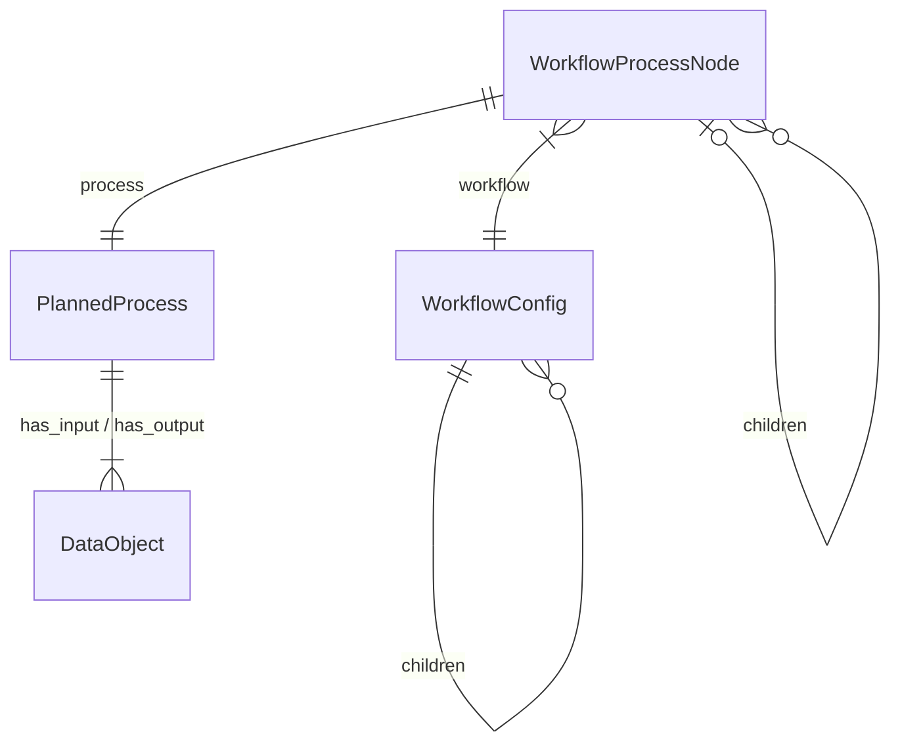
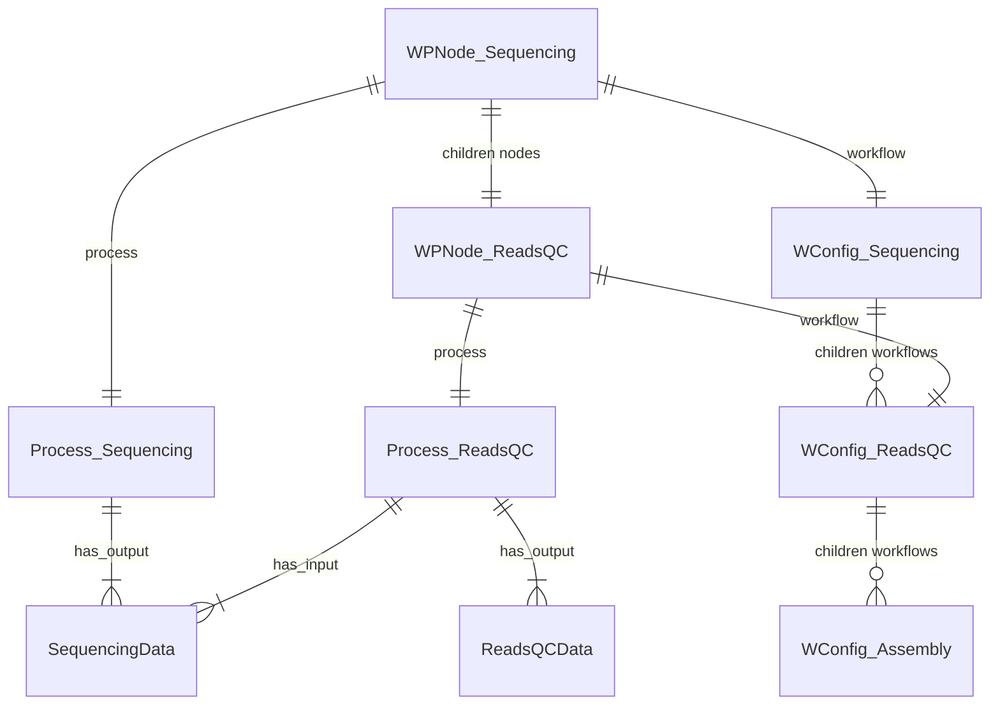
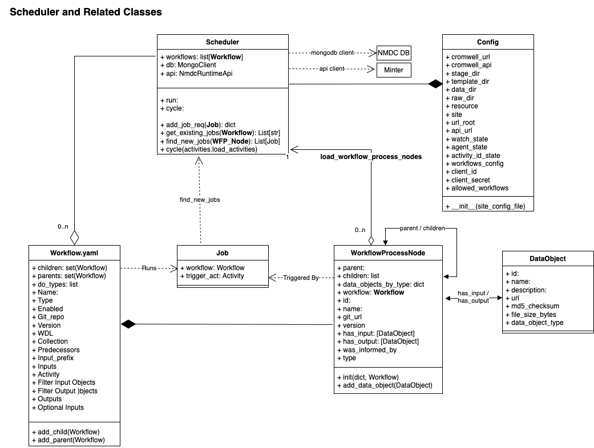
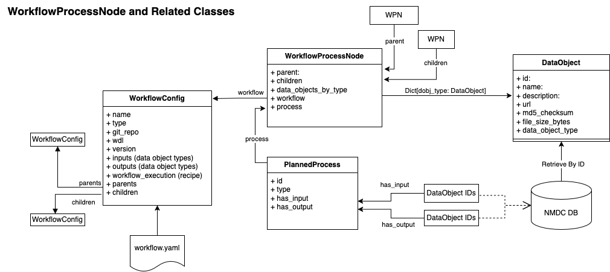
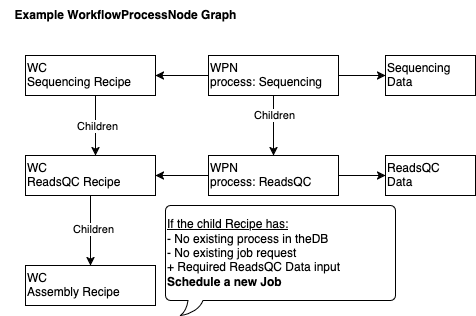
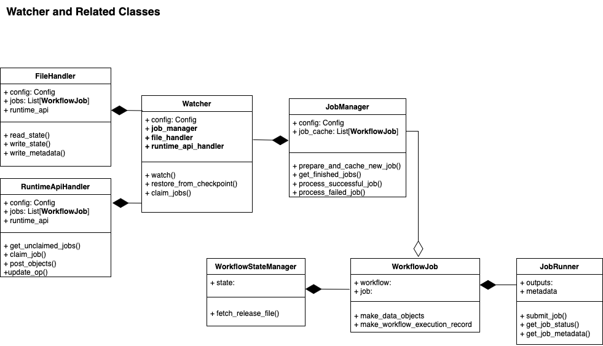
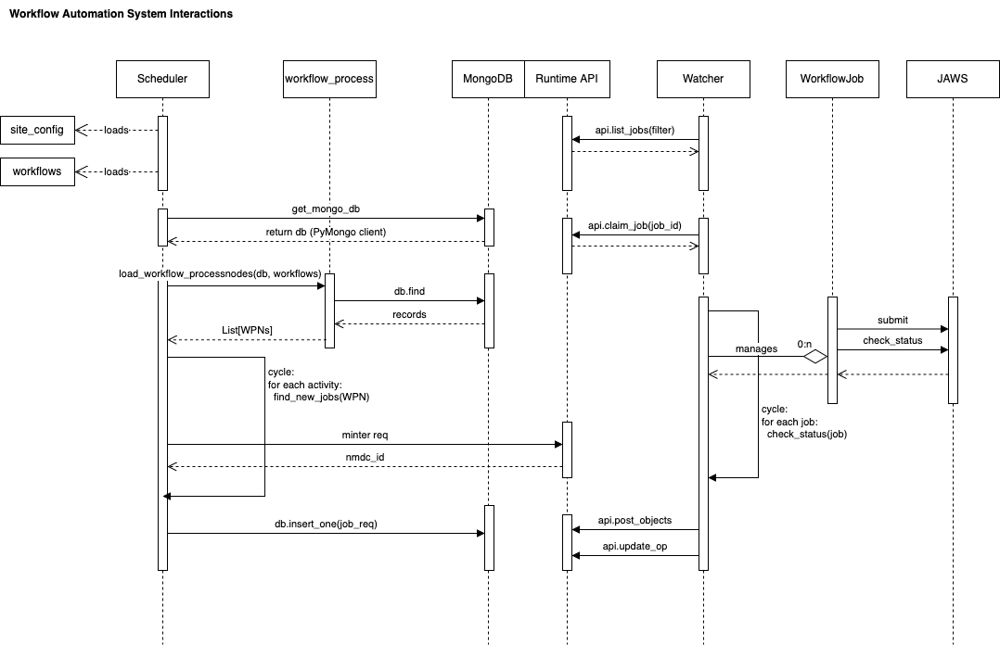

# Developer Documentation — NMDC Workflow Automation

This document covers the architecture, implementation internals, and development workflow for the NMDC Workflow Automation system. It is intended for developers working on the codebase, particularly those involved in workflow automation and job scheduling.

For operational instructions (running the Scheduler and Watcher in production, handling failed jobs), see the [main README](../README.md). For access setup and environment onboarding, see the [Troubleshooting Guide](README_troubleshooting.md#onboarding--access-setup).

## Table of Contents

- [Developer Documentation — NMDC Workflow Automation](#developer-documentation--nmdc-workflow-automation)
  - [Table of Contents](#table-of-contents)
  - [System Architecture \& Components](#system-architecture--components)
    - [Components](#components)
      - [Scheduler](#scheduler)
      - [Workflow Process Node Loader](#workflow-process-node-loader)
      - [Watcher](#watcher)
      - [WorkflowJob \& JobRunner](#workflowjob--jobrunner)
    - [Interactions \& Data Flow](#interactions--data-flow)
  - [Developer Quickstart](#developer-quickstart)
  - [Poetry Environment](#poetry-environment)
  - [Configuration \& Environment](#configuration--environment)
    - [TOML Site Config](#toml-site-config)
    - [YAML Workflow Definitions](#yaml-workflow-definitions)
    - [Environment Variables](#environment-variables)
  - [Core Modules \& References](#core-modules--references)
  - [NMDC Workflow Scheduler](#nmdc-workflow-scheduler)
    - [Key Classes \& Functions](#key-classes--functions)
      - [Scheduler](#scheduler-1)
      - [SchedulerJob](#schedulerjob)
      - [`within_range(wf1, wf2)`](#within_rangewf1-wf2)
    - [Running the Scheduler Locally](#running-the-scheduler-locally)
    - [Dependencies](#dependencies)
  - [NMDC Workflow Process Node Loader](#nmdc-workflow-process-node-loader)
    - [Algorithm Overview](#algorithm-overview)
    - [Diagrams](#diagrams)
  - [Development Workflow](#development-workflow)
    - [Branching](#branching)
    - [Pull Requests](#pull-requests)
  - [Working with Workflows](#working-with-workflows)
    - [Understanding the Workflow YAML](#understanding-the-workflow-yaml)
    - [Bumping Workflow Versions](#bumping-workflow-versions)
    - [Selecting Test Records for Development](#selecting-test-records-for-development)
    - [Bumping NMDC Schema Version](#bumping-nmdc-schema-version)
    - [Debugging JAWS Jobs](#debugging-jaws-jobs)
  - [Testing](#testing)
    - [Startup scripts](#startup-scripts)
  - [Safety Notes for Production](#safety-notes-for-production)

---

## System Architecture & Components

The NMDC Workflow Automation system automates metagenome workflow executions by discovering upstream activities and creating downstream jobs when input data and version compatibility allow. It builds a graph of workflow activities from provenance data, constructs job definitions, and submits them to a configured runner (JAWS / Cromwell), while tracking status and processing outputs.

### Components

#### Scheduler

- **Purpose:** Scan MongoDB for upstream workflow activities (DataGeneration / WorkflowExecution) and create downstream job records when requirements are met.
- **Key behavior:** Loads workflow definitions from `workflows.yaml`, builds `WorkflowProcessNode` graphs via `load_workflow_process_nodes()`, and schedules jobs when child inputs exist and no child node or job already exists. Key methods: `cycle()`, `find_new_jobs()`, `create_job_rec()`.
- **Job creation:** Constructs job records with WDL path, repository/version, input object URLs, execution metadata (`was_informed_by`, iteration, input prefix), and optional pre-minted output IDs via `NmdcRuntimeApi`. Jobs are written to the MongoDB `jobs` collection unless `DRYRUN=1`.

A **Workflow Process Node** is a representation of:
- `workflow` — the workflow configuration from `workflows.yaml` (may include `workflow.children`)
- `process` — the planned process from MongoDB (DataGeneration or WorkflowExecution)
- `parent` and `children` — pointers linking upstream and downstream nodes

<details><summary>Workflow Process Node entity diagram</summary>


```mermaid
erDiagram
    WorkflowProcessNode ||--|| PlannedProcess: "process"
    PlannedProcess ||-- |{ DataObject: "has_input / has_output"
    WorkflowProcessNode }|--|| WorkflowConfig: "workflow"
    WorkflowConfig ||--o{ WorkflowConfig: "children"
    WorkflowProcessNode |o--o| WorkflowProcessNode: "parent"
    WorkflowProcessNode |o--o{ WorkflowProcessNode: "children"
```
</details>

A scheduler node will schedule a child workflow when all three conditions are met:
1. The node lists a child workflow in `node.workflow.children`.
2. The node currently has no corresponding child node in `node.children`.
3. The required inputs for the child workflow are available in the node's process outputs.

<details><summary>Scheduler process entity diagram</summary>


```mermaid
erDiagram
    WPNode_Sequencing ||--|| WPNode_ReadsQC: "children nodes"
    WPNode_Sequencing ||--|| WConfig_Sequencing: "workflow"
    WConfig_Sequencing ||--o{ WConfig_ReadsQC: "children workflows"
    WPNode_Sequencing ||--|| Process_Sequencing: "process"
    Process_Sequencing ||-- |{ SequencingData: "has_output"
    WPNode_ReadsQC ||--|| Process_ReadsQC: "process"
    Process_ReadsQC ||--|{ SequencingData: "has_input"
    Process_ReadsQC ||-- |{ ReadsQCData: "has_output"
    WPNode_ReadsQC ||--|| WConfig_ReadsQC: "workflow"
    WConfig_ReadsQC ||--o{ WConfig_Assembly: "children workflows"
```
</details>

#### Workflow Process Node Loader

- **Purpose:** Build a DAG of `WorkflowProcessNode` objects from DB records, associating nodes with the DataObjects they consume and produce.
- **Algorithm overview:**
  1. Load required DataObjects and build an `id → object` map.
  2. Identify relevant activities by analyte category, input/output filters, and version compatibility.
  3. Map outputs to producing nodes.
  4. Resolve parent/child relationships by shared inputs.

Version compatibility relies on major/minor matching (or can be forced with `FORCE=1`).

#### Watcher

- **Purpose:** Monitor the `jobs` collection, claim unclaimed jobs, and manage the execution lifecycle.
- **Behavior:** For each claimed job the Watcher creates a `WorkflowJob` (containing a `WorkflowStateManager` and a `JobRunner`), submits the job to the runner, polls for status, and processes success or failure. The Watcher records its activity in a state file.

#### WorkflowJob & JobRunner

- **WorkflowJob:** Combines a state manager and job runner to prepare inputs, submit workflows, and track execution.
- **JobRunner:** Prepares inputs, submits to JAWS / Cromwell (or another runner), handles post-run data and metadata processing, and updates job status via `NmdcRuntimeApi`.

### Interactions & Data Flow

External systems: MongoDB (metadata & jobs), NMDC Runtime API (ID minting & updates), JAWS / Cromwell (workflow execution), YAML workflow definitions, TOML site configs.

Data flow summary:
1. Scheduler queries MongoDB and builds a `WorkflowProcessNode` graph.
2. Scheduler creates job records for runnable workflows.
3. Watcher claims and runs jobs via JAWS or another runner.
4. Watcher / JobRunner updates job status and outputs to the API / DB.

---

## Developer Quickstart

```bash
git clone https://github.com/microbiomedata/nmdc_automation.git
cd nmdc_automation

# Install dependencies and activate environment
poetry install
eval $(poetry env activate)

# Start MongoDB (macOS)
brew services start mongodb-community

# Run tests to verify setup
make test

# Dry-run the scheduler locally with an allowlist
DRYRUN=1 ALLOWLISTFILE=allow.lst python -m nmdc_automation.workflow_automation.sched \
    path/to/site_configuration.toml \
    path/to/workflows.yaml
```

---

## Poetry Environment

Poetry manages the virtual environment and ensures all developers work with the same package versions.

**Activate the environment for your current branch:**

```bash
poetry install
eval $(poetry env activate)
```

`poetry install` uses `poetry.lock` to build a consistent environment. See [Poetry docs](https://python-poetry.org/docs/basic-usage/#installing-with-poetrylock).

**Update the lock file after changing dependencies:**

```bash
poetry update
```

Run `poetry update` whenever you modify `pyproject.toml` (e.g., upgrading JAWS or NMDC Schema dependencies). Update and commit `poetry.lock` before merging into `main` — mismatched lock files cause CI/CD failures, especially when schema changes are not reflected in test fixtures.

<details><summary>Example poetry update output</summary>

```
>> poetry update
The currently activated Python version 3.13.5 is not supported by the project (>=3.10,<3.12).
Trying to find and use a compatible version.
Using python3.11 (3.11.13)
Resolving dependencies... (5.9s)

Package operations: 0 installs, 6 updates, 1 removal

  • Removing roman-numerals-py (3.1.0)
  • Updating certifi (2025.7.9 -> 2025.7.14)
  • Updating jsonschema (4.24.0 -> 4.25.0)
  • Updating orderly-set (5.4.1 -> 5.5.0)
  • Updating linkml-runtime (1.9.3 -> 1.9.4)
  • Updating slack-sdk (3.35.0 -> 3.36.0)
  • Updating nmdc-schema (11.8.0 -> 11.9.1)

Writing lock file

>> poetry install
...
Installing the current project: nmdc-automation (0.1.0)

>> eval $(poetry env activate)
...
(nmdc-automation-py3.11) >>
```
</details>

---

## Configuration & Environment

### TOML Site Config

Defines site-specific settings: API credentials, runner URLs, filesystem paths, and state file location.

```toml
[nmdc_api]
url = "https://api.microbiomedata.org"
username = "user"
password = "pass"

[runner]
type = "jaws"
url = "https://jaws.api"
```

### YAML Workflow Definitions

Describes workflows with inputs, outputs, children, versions, and WDL references. The default file is [nmdc_automation/config/workflows/workflows.yaml](../nmdc_automation/config/workflows/workflows.yaml). 

<details><summary>Interleaved RQC workflow entry</summary>

```yaml
  - Name: Reads QC
    Type: nmdc:ReadQcAnalysis
    Enabled: True
    Analyte Category: Metagenome
    Git_repo: https://github.com/microbiomedata/ReadsQC
    Version: v1.0.14-alpha.2
    WDL: rqcfilter.wdl
    Collection: workflow_execution_set
    Filter Input Objects:
    - Metagenome Raw Reads
    Predecessors:
    - Sequencing Interleaved
    Input_prefix: rqcfilter
    Inputs:
      input_files: do:Metagenome Raw Reads
      proj: "{workflow_execution_id}"
      shortRead: true
      interleaved: true
    Workflow Execution:
      name: "Read QC for {id}"
      input_read_bases: "{outputs.stats.input_read_bases}"
      input_read_count: "{outputs.stats.input_read_count}"
      output_read_bases: "{outputs.stats.output_read_bases}"
      output_read_count: "{outputs.stats.output_read_count}"
      type: nmdc:ReadQcAnalysis
    Outputs:
      - output: filtered_final
        name: Reads QC result fastq (clean data)
        data_object_type: Filtered Sequencing Reads
        description: Reads QC for {id}
      - output: filtered_stats_final
        name: Reads QC summary statistics
        data_object_type: QC Statistics
        description: Reads QC summary for {id}
      - output: rqc_info
        name: File containing read filtering information
        data_object_type: Read Filtering Info File
        description: Read filtering info for {id}
```
</details>

### Environment Variables

| Variable | Effect |
|---|---|
| `DRYRUN=1` | Jobs not inserted into MongoDB |
| `FORCE=1` | Ignore version compatibility checks |
| `ALLOWLISTFILE` | Only schedule IDs listed in the specified file |
| `SKIPLISTFILE` | Skip IDs listed in the specified file |
| `MOCK_MINT=1` | Use fake IDs for testing (no real API minting) |
| `NMDC_WORKFLOW_YAML_FILE` | Path to the workflow configuration YAML file |

---

## Core Modules & References

**`nmdc_automation.scheduler`**
Orchestrates discovery and job creation.
- Key functions: `cycle()`, `find_new_jobs()`, `create_job_rec()`
- Key classes: `Scheduler` (main scheduling loop), `SchedulerJob` (holds workflow config & trigger node)

**`nmdc_automation.workflow_automation.workflow_process`**
Builds a DAG of workflow activities from the DB.
- Key function: `load_workflow_process_nodes(db, workflows, allowlist)`
- Key classes: `WorkflowProcessNode` (node in the workflow graph), `WorkflowProcessNodeLoader` (loads nodes from MongoDB)

**`nmdc_automation.api`**
Wraps NMDC Runtime API calls for job updates and ID minting.
- Key functions: `mint_id()`, `update_job_status()`
- Key classes: `NmdcRuntimeApi` (handles API interactions), `NmdcRuntimeApiError` (custom error type)

---

## NMDC Workflow Scheduler

This module implements the job scheduling system. It identifies candidate workflow jobs from upstream process nodes and generates executable job records for compatible and enabled workflows.

The core `Scheduler` class:

- Loads and parses workflow configurations from YAML:
  ```python
  self.workflows = load_workflow_configs(workflow_yaml)
  ```
- Periodically queries the database for candidate activities:
  ```python
  load_workflow_process_nodes(self.db, self.workflows, allowlist)
  ```
- Determines whether a new job should be created by checking that:
  - The workflow is enabled
  - No previous job already exists for this process node
  - No equivalent workflow execution already exists (matching major/minor version)
- Constructs and stores job definitions in MongoDB using workflow WDL path, repository, version, input data object URLs, execution metadata, and optionally pre-minted output IDs via `NmdcRuntimeApi`
- Supports dry runs, skiplists, allowlists, and forced version scheduling

### Key Classes & Functions

#### Scheduler

Main orchestrator for job scheduling.

| Method | Description |
|---|---|
| `__init__` | Loads workflows, sets up API, applies force mode |
| `cycle()` | Performs one scheduling pass |
| `run()` | Async wrapper to run `cycle()` in a loop |
| `create_job_rec()` | Constructs job records from workflow and input data |
| `find_new_jobs()` | Finds valid job opportunities for a given `WorkflowProcessNode` |

#### SchedulerJob

Lightweight container holding a `WorkflowConfig` and its triggering activity.

#### `within_range(wf1, wf2)`

Checks if two workflows are version-compatible (same major.minor version, or exact match if forced).

### Running the Scheduler Locally

Basic invocation:

```bash
python -m nmdc_automation.workflow_automation.sched \
    path/to/site_configuration.toml \
    path/to/workflows.yaml
```

Common recipes:

```bash
# Dry-run — inspect what would be scheduled without writing to MongoDB
DRYRUN=1 ALLOWLISTFILE=allow.lst \
    python -m nmdc_automation.workflow_automation.sched \
    path/to/site_configuration.toml path/to/workflows.yaml

# Local testing with fake IDs
MOCK_MINT=1 ALLOWLISTFILE=allow.lst DRYRUN=1 \
    python -m nmdc_automation.workflow_automation.sched \
    path/to/site_configuration.toml path/to/workflows.yaml

# Force reschedule (ignore version compatibility)
FORCE=1 ALLOWLISTFILE=allow.lst \
    python -m nmdc_automation.workflow_automation.sched \
    path/to/site_configuration.toml path/to/workflows.yaml
```

Start the Watcher locally:

```bash
python -m nmdc_automation.run_process.run_workflows watcher \
    --config path/to/site_configuration.toml daemon
```

### Dependencies

- `nmdc_automation.api.NmdcRuntimeApi`
- `nmdc_automation.workflow_automation.workflow_process.load_workflow_process_nodes`
- MongoDB (job storage)
- `semver` (version compatibility checking)

---

## NMDC Workflow Process Node Loader

`load_workflow_process_nodes` constructs a directed acyclic graph (DAG) of `WorkflowProcessNode` objects from the database by loading relevant activities, filtering and validating them against workflow configuration, associating each with its input/output DataObjects, and resolving parent-child relationships based on shared data dependencies.

### Algorithm Overview

**Inputs:**
- MongoDB database handle (`db`)
- List of `WorkflowConfig` objects (`workflows`)
- Optional list of record IDs to restrict analysis (`allowlist`)

**Output:**
- List of fully linked `WorkflowProcessNode` objects

**Step 1 — Load Required Data Objects** (`get_required_data_objects_map()`)

Extracts and loads all DataObjects from the database matching input/output types required by the workflows. Builds a dictionary mapping `DataObject.id → DataObject`.

**Step 2 — Identify Relevant Workflow Activities** (`get_current_workflow_process_nodes()`)

Divides workflows by type (DataGeneration records from `data_generation_set` vs. WorkflowExecution records from `workflow_execution_set`) and queries the DB for records matching the workflow's `analyte_category`, input/output requirements, version compatibility, and `was_informed_by` lineage. Wraps each matched record as a `WorkflowProcessNode`.

**Step 3 — Associate Nodes with Output Data Objects** (`_map_nodes_to_data_objects()`)

Maps each node's output DataObjects back to the node that produced them. Detects and warns about duplicate data object IDs, which may indicate a data hygiene issue.

**Step 4 — Resolve Parent-Child Relationships** (`_resolve_relationships()`)

For each node, checks its inputs. If another node produced one of its inputs and matches an expected parent workflow, that node is linked as the parent. Adds parent and children pointers to represent execution order.

**Result:** A fully connected activity graph rooted in your database's provenance data. Each node knows its workflow, the data it consumed and produced, and its immediate parent and children nodes.

**Implementation notes:**
- `_within_range()` treats workflows as compatible if their major versions match.
- The system warns about missing data or mismatches in `was_informed_by` lineage.
- This logic assumes workflows have exactly one analyte category.

### Diagrams

For schema type code mappings, refer to the [NMDC Schema documentation](https://microbiomedata.github.io/nmdc-schema/typecode-to-class-map/).











---

## Development Workflow

### Branching

- `main` is protected; all work requires a feature branch.
- Use descriptive branch names: `feature/new-workflow` or `ticket-#-short-title`.

### Pull Requests

- Use a pre-release to test the image and environment on `dev` before merging to `main`. See the [Release Documentation](https://github.com/microbiomedata/infra-admin/blob/main/releases/nmdc-automation.md).
- CI/CD and the test workflow must pass before merge.
- Include schema updates if applicable.
- Run `poetry update` and commit the updated `poetry.lock` before merging.

---

## Working with Workflows

### Understanding the Workflow YAML

Automation runs a series of workflows that are configured in the `workflows.yaml` file. Each workflow entry specifies:

- **Workflow metadata:** Name, type, version, git repository, and WDL file path
- **Inputs and outputs:** Data object types required and produced (defined by [nmdc-schema](https://microbiomedata.github.io/nmdc-schema/)). Used to generate input JSON files for JAWS. 
- **Workflow execution fields:** Database fields that will be populated (see the "Workflow Execution" section of the schema docs)

The YAML entries map directly to the WDL workflow definitions. Variable names must match between the YAML and WDL for workflows to be processed correctly.

**Example mapping:**

| YAML (workflows.yaml) | WDL (workflow file) | Schema field |
|---|---|---|
| `input_files` | `input_files` | `has_input` |
| `proj` | `project` or `proj` | workflow execution ID |

**Key resources:**
- NMDC Schema docs: https://microbiomedata.github.io/nmdc-schema/ (e.g., [ReadQcAnalysis](https://microbiomedata.github.io/nmdc-schema/ReadQcAnalysis/))
- Each workflow's WDL file has clear `input` and `output` sections — review these to understand data flow

### Bumping Workflow Versions

Each workflow (ReadsQC, Assembly, Annotation, etc.) has its own git repository with independent development and releases. When a new workflow version is released, test it in automation before deploying to production.

**Process:**

1. **Create a feature branch** in `nmdc_automation`:
   ```bash
   git checkout -b ticketnum-readsqc-v1.0.22
   ```

2. **Update `workflows.yaml`:**
   ```yaml
   - Name: Reads QC
     Version: v1.0.22  # was v1.0.14-alpha.2
     Git_repo: https://github.com/microbiomedata/ReadsQC
     # ... rest of config
   ```

3. **Update test fixtures** in `tests/` to match the new version and any output schema changes. This is moreso for major changes in input and output files.

4. **Dry-run the scheduler locally:**
   ```bash
   DRYRUN=1 ALLOWLISTFILE=test_allow.lst python -m nmdc_automation.workflow_automation.sched \
       site_configuration_local.toml \
       workflows.yaml
   ```

5. **Create a release candidate** (e.g., `0.17.0-rc.1`) — see the [Release Documentation](https://github.com/microbiomedata/infra-admin/blob/main/releases/nmdc-automation.md).

6. **Select a test Data Generation record** (see [Selecting Test Records](#selecting-test-records-for-development) below).

7. **Run on dev:** Deploy the release candidate to the dev Scheduler and Watcher, add the test ID to the dev `allow.lst`, and monitor the run.

8. **Verify results:** Check that the workflow execution completes successfully and outputs are correctly posted to the dev database.

9. **Merge and release:** Once validated, merge the PR and cut an official release.

### Selecting Test Records for Development

To test workflow changes or schema updates on the dev environment without affecting production data:

1. **Choose a known-good record** that ran successfully in production recently. This ensures you're testing with valid inputs.

2. **Delete existing workflow executions** for that record in the dev database using the [delete workflow executions endpoint](https://api-dev.microbiomedata.org/docs#/workflows/delete_workflow_executions_workflows_workflow_executions_delete):
   - This removes all workflow execution records and associated jobs for the Data Generation ID
   - The dev database is overwritten by prod with every release, so no cleanup is needed afterward

3. **Add the Data Generation ID** to the dev `allow.lst` and restart the dev Scheduler.

4. **Monitor the run** through the dev Watcher logs and JAWS.

**Example:**
```bash
# 1. Use API to delete existing executions for nmdc:dgns-11-abc123
# (via the API endpoint)

# 2. Add to dev allow.lst on Rancher
echo "nmdc:dgns-11-abc123" >> /conf/allow.lst

# 3. Restart dev Scheduler
./run_scheduler.sh
```

### Bumping NMDC Schema Version

When the `nmdc-schema` package releases a new version, update the dependency in `pyproject.toml`:

1. **Update `pyproject.toml`:**
   ```toml
   [tool.poetry.dependencies]
   nmdc-schema = "^11.16.0"  # was ^11.15.0
   ```

   The `^` (caret) allows compatible updates: `^11.16.0` will install `11.16.0`, `11.16.1`, etc., but not `11.17.0` or `12.0.0`. See [Poetry dependency specification](https://python-poetry.org/docs/dependency-specification/) for details.

2. **Run `poetry update`:**
   ```bash
   poetry update
   ```

   Poetry will resolve the new schema version and any transitive dependency changes. The `poetry.lock` file will reflect the exact versions installed. For example, specifying `^11.16.0` might result in `11.16.1` if patches have been released.

3. **Review the changes:**
   ```bash
   git diff poetry.lock
   ```

4. **Update test fixtures** if the schema changes affect workflow execution fields or data object types.

5. **Test locally:**
   ```bash
   make test
   ```

6. **Commit both files:**
   ```bash
   git add pyproject.toml poetry.lock
   git commit -m "Bump nmdc-schema to ^11.16.0"
   ```

7. **Follow the release process** to deploy and test on dev before merging to `main`.

### Debugging JAWS Jobs

When a job fails in JAWS, use the workflow root directory to trace errors and inspect intermediate files.

**Steps:**

1. **Get the JAWS job ID** from the Watcher `agent.state` file or MongoDB `jobs` collection.

2. **Check job status:**
   ```bash
   jaws status <job_id>
   ```

   <details><summary>Example output:</summary>

   ```json
    {
      "compute_site_id": "nmdc",
      "cpu_hours": null,
      "cromwell_run_id": "6987bea6-8cde-4e08-9611-0d6727ae279d",
      "id": 166534,
      "input_site_id": "nmdc",
      "json_file": "interleave.json",
      "output_dir": null,
      "result": null,
      "status": "queued",
      "status_detail": "At least one task has requested resources but no tasks have started running yet",
      "submitted": "2026-02-16 14:53:24",
      "tag": null,
      "team_id": "nmdc",
      "updated": "2026-02-16 14:54:01",
      "user_id": "nmdcda",
      "wdl_file": "interleave_rqcfilter.wdl",
      "workflow_name": "nmdc_rqcfilter",
      "workflow_root": "/pscratch/sd/n/nmjaws/nmdc-prod/cromwell-executions/nmdc_rqcfilter/6987bea6-8cde-4e08-9611-0d6727ae279d"
    }
   ```
   </details>

1. **Navigate to the `workflow_root` directory:** 
   ```bash
   cd /pscratch/sd/n/nmjaws/nmdc-prod/cromwell-executions/nmdc_assembly/0fddc559-833e-4e14-9fa5-1e3d485b232d
   ```
   If you're navigating via VSCode, you can do a `cmd+click` on the path, depending on OS.

2. **Explore the execution directory structure:**
   - `call-<task_name>/` — subdirectories for each WDL task
   - `call-<task_name>/execution/` — contains:
     - `stdout` and `stderr` — task output and errors
     - `script` — the actual command that was run
     - Input and output files for the task
   - `call-<task_name>/inputs/` — symlinks to input files

3. **Check common failure points:**
   - **Input files:** Verify they exist and are not corrupted
   - **stderr:** Look for error messages from the tool
   - **stdout:** Check for unexpected output or warnings
   - **script:** Confirm the command looks correct and parameters match expectations
   - **Resource limits:** Look for out-of-memory or timeout errors

4. **Example investigation:**
   ```bash
   # Check the stage task stderr
   cat call-stage/execution/stderr
   
   # Verify input file integrity
   ls -lh call-stage/inputs/
   
   # Check what command was actually run
   cat call-stage/execution/script
   ```

5. **Common issues:**
   - **Download failures:** Input file URLs are unreachable or corrupted
   - **Resource exhaustion:** Job ran out of memory or disk space
   - **Tool errors:** The underlying scientific tool (SPAdes, Prodigal, etc.) failed due to bad input or a bug
   - **Workflow bugs:** Incorrect WDL logic or parameter passing

For systemic issues (bad WDL logic, schema mismatches), file an issue in the workflow's git repository. For transient issues (download errors, quota), retry the job.

---

## Testing

Unit tests live in `tests/`. Run with:

```bash
make test
# or
pytest -v
```

To run a specific test file:

```bash
poetry run pytest tests/test_file.py
```

Integration tests require a running MongoDB instance with seeded data. Full integration test setup documentation is pending.

### Startup scripts

The startup scripts for the [scheduler](../bin/run_scheduler.sh) and [watcher](../bin/run_watcher.sh) are shell scripts that use Slack apps (formerly webhooks) for up/down messaging. Both scripts write to long running log files that are not to be cleared unless otherwise indicated by product owners. The links for Slack integration are located in the configurate TOML files. In the case they are changed on the Slack end, the channels they send to have the apps and integrations pinned for easy navigation. For those with permissions, navigate to **[Slack API](https://api.slack.com/apps) → Your Apps → `incoming-notifs` → Incoming Webhooks** to change or copy the links to the TOML. 


---

## Safety Notes for Production

- **Always dry-run first** before scheduling new jobs in production.
- Review `workflows.yaml` changes carefully — typos can cause silent scheduling failures.
- Back up site configs and allow/skip lists before editing.
- Check your poetry environment when switching branches, especially after schema dependency changes.
- `jaws resubmit <id>` will update the job in JAWS but will **not** update the Scheduler or NMDC database. Use the API release endpoint for full resubmission through the normal pipeline.
